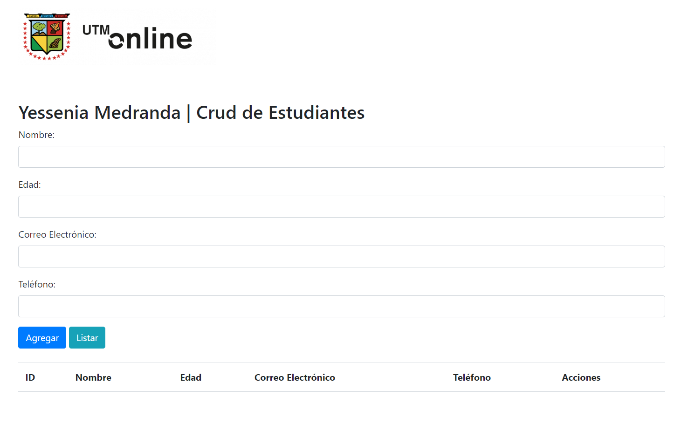
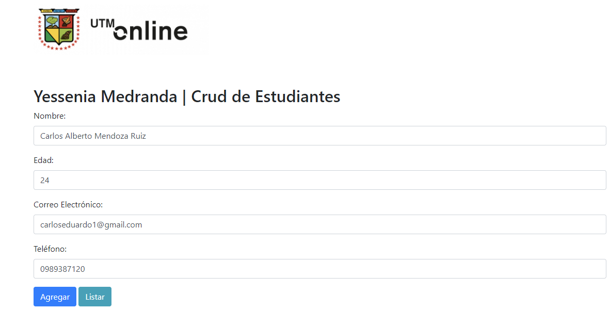
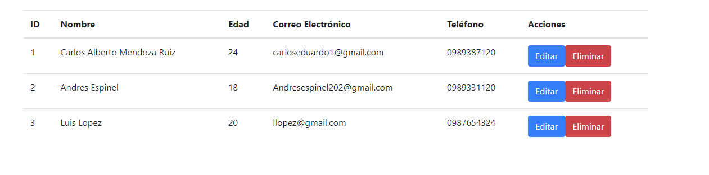

# CRUDAPP
#### Inicio

Este programa funciona haciendo uso de Html,CSS, Javascript y Jquery, como tal se ha basado en el hecho de poder crear un crud de estudiantes, ademas del uso de bootstrap para poder crear los respectivos elementos pertenecientes a esta pagina como tal. 

#### Registro
 
Registro de estudiante

#### Listado de estudiantes

 
Listado de estudiantes
